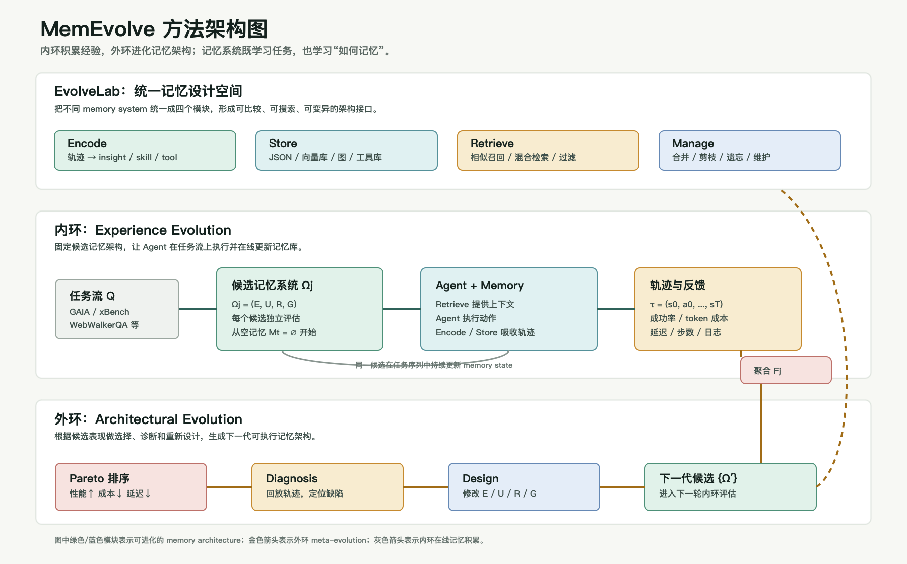
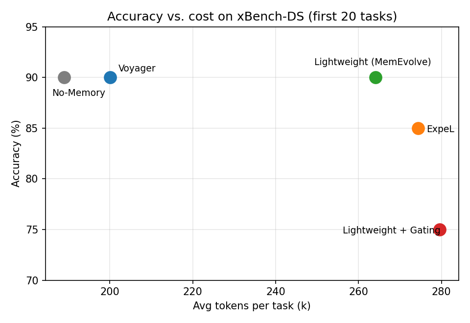
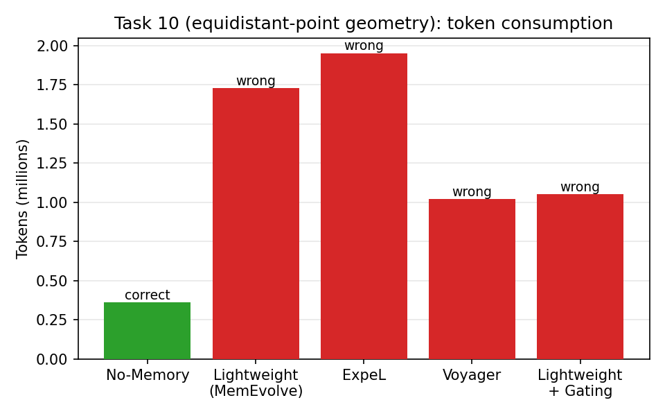

# 实验报告：Memory Systems that Evolve

> 论文：[MemEvolve: Meta-Evolution of Agent Memory Systems](https://arxiv.org/abs/2512.18746)（arXiv 2512.18746）
> 实验基于官方实现 [bingreeky/MemEvolve](https://github.com/bingreeky/MemEvolve)（commit `6035d56`）。复现步骤见 README。


## 0.论文内容
### 方法
EvolveLab（基础设施）：先把 12 个代表性记忆系统统一重实现到一个模块化设计空间里，任何记忆系统都被分解为四个组件——Encode（把原始经验转成结构化表示）、Store（持久化存储）、Retrieve（按上下文召回）、Manage（整合与遗忘）。这四元组就构成一个记忆架构的"基因型"，让架构层面的进化变得可操作。
MemEvolve（双层优化）：这是个典型的 bilevel 结构，形式上类似 meta-learning 的内外环（但不是基于梯度，而是 LLM 驱动的离散搜索）：

内环（经验进化）：固定一组候选记忆架构，让 Agent 带着每个架构跑一批任务（每轮 60 条轨迹），往记忆库里填经验，同时收集三维反馈：任务成功率、token 成本、延迟。
外环（架构进化）：用 Pareto 排序在性能/成本/延迟之间做非支配筛选，保留 top-K 架构作为"父代"，然后通过 Diagnose-and-Design 产生后代——先用 LLM 回放轨迹诊断出结构性缺陷（如检索失败、抽象无效、记忆内容过长），生成缺陷报告，再据此只在四个模块的允许范围内做受约束的重新设计，每个父代产出 S=3 个变体。

两个环形成正反馈：更好的架构让 Agent 学得更快，更强的 Agent 产生更高质量的轨迹，给外环提供更精确的适应度信号。



### 主要结论
性能：在 GAIA、xBench-DS、WebWalkerQA、TaskCraft 四个基准上，MemEvolve 给 SmolAgent 和 Flash-Searcher 带来最高 17.06% 的提升。Flash-Searcher+GPT-5-mini 在 GAIA 上 pass@3 达到 80.61%，超过 OWL-Workforce、CK-Pro 等多智能体系统。而且成本几乎没涨（GAIA 上每任务 $0.085 vs 无记忆基线 $0.086）。
泛化性：这是比较有说服力的部分——在 TaskCraft 上进化出的记忆系统，不做任何任务特定调整，直接迁移到更难的基准、换成没见过的底座模型（Kimi K2、DeepSeek V3.2）、甚至插到完全不同的 Agent 框架（OWL、CK-Pro）上，都有一致提升。说明它学到的是任务无关的记忆设计原则，而非过拟合某个数据集。作者也坦诚了边界：在共享任务范式内可以泛化，但跨到根本不同的任务族（如具身智能）大概率不行。
涌现出的设计规律：观察进化轨迹（AgentKB → Riva → Cerebra）发现几个趋势——记忆的编解码越来越依赖 Agent 自主决策而非预定义流水线（agentic 化）、层级化组织、多粒度抽象，后期还自发学会了从经验中蒸馏可复用工具并定期维护记忆库。

## 1. 实验设置

我在 Flash-Searcher（仓库自带的深搜 agent 框架）上用 `deepseek-v4-flash` 跑了 xBench-DeepSearch 的前 20 条任务，对比四个设置：

| 项目 | 取值 |
|---|---|
| 模型 | `deepseek-v4-flash`（DeepSeek 官方 API，OpenAI 兼容接口） |
| 判分 | LLM-as-a-Judge，裁判模型同为 `deepseek-v4-flash`（裁判与被试同源，§5 有讨论） |
| Benchmark | xBench-DeepSearch（2505 版加密 CSV），取前 20 条（`data[:20]`，四个设置看到的任务集合与顺序完全一致） |
| Memory 设置 | ① No-Memory（对照）② `lightweight_memory`（**MemEvolve 自动进化产物**，用的是官方发布版本，我没有重新跑 meta-evolution）③ `expel`（semantic 记忆 baseline）④ `voyager`（procedural 记忆 baseline）；另有 ⑤ Lightweight + 验证门控 patch（§6.1 的 ablation） |
| 实验规模 | 5 组 × 20 条 = 100 条任务（主实验 4 组 80 条 + ablation 1 组 20 条）；另有若干冒烟/调试重跑不计入报告 |
| 运行参数 | `max_steps=40`；memory 组 `concurrency=1`（串行，保证记忆逐条积累，对应论文的 online 模式）；No-Memory 组 `concurrency=4` |
| 控制变量 | 每个 memory run 开始前我都清空了对应的 `storage/<provider>/`，保证从空记忆起步；跑完立刻把记忆终态归档备份 |
| ⚠️ 已知混淆 | `lightweight_memory` 初始化即注入 7 条出厂"冷启动记忆"（5 策略 + 2 操作），严格说它和"空记忆起步"的 baseline 不在同一起跑线，解读 Lightweight 结果时需考虑此项（详见 §5）。 |

### 复现命令

> ⚠️ `patches/0002`（验证门控）会改写 `lightweight_memory_provider.py`。它**只用于 §6.1 的 ablation**——主实验四组**绝对不要**应用它，否则跑出来的"原版 Lightweight"已被污染。下面拆成两段，互不混用。

> 完整的环境/数据准备与 `.env` 关键项（**裁判模型 `DEFAULT_JUDGE_MODEL` 必须显式设为 deepseek-v4-flash，否则 runner 默认落到 gemini-2.5-flash、xBench 全判错**；`OPENAI_BASE_URL` 与 `OPENAI_API_BASE` 两个都设）见 README。下面命令均显式传 `--judge_model` 做双保险。

**主实验 4 组（只 apply 0001）：**

```bash
git clone https://github.com/bingreeky/MemEvolve.git && cd MemEvolve
git checkout 6035d56
git apply <本仓库>/patches/0001-fix-xbench-accuracy-report.patch   # 只修判分统计 bug
cp <本仓库>/scripts/summarize_results.py Flash-Searcher-main/
cd Flash-Searcher-main   # 完成 README 的环境/数据准备

# Run 0: No-Memory 对照（concurrency=4 仅为省时，耗时不与串行组横向比较，见 §2 脚注）
python run_flash_searcher_mm_xbench.py \
    --infile ./data/xbench/DeepSearch.csv --outfile ./xbench_output/nomem_20.jsonl \
    --judge_model deepseek-v4-flash --sample_num 20 --max_steps 40 --concurrency 4

# Run 1–3: 三个 memory system（串行，每个跑前清空自己的 storage）
for p in lightweight_memory expel voyager; do
    rm -rf "storage/$p"
    python run_flash_searcher_mm_xbench.py \
        --infile ./data/xbench/DeepSearch.csv --outfile "./xbench_output/${p%_memory}_20.jsonl" \
        --memory_provider "$p" --judge_model deepseek-v4-flash --sample_num 20 --max_steps 40
done

python summarize_results.py xbench_output/*_20.jsonl   # 汇总（绕过 eval_utils 判分 bug，见 §5）
```

**ablation（§6.1，在一份干净 checkout 上额外 apply 0002）：**

```bash
git clone https://github.com/bingreeky/MemEvolve.git memevolve-ablation && cd memevolve-ablation
git checkout 6035d56
git apply <本仓库>/patches/0001-fix-xbench-accuracy-report.patch
git apply <本仓库>/patches/0002-add-verification-gating.patch    # 仅此分支应用
cp <本仓库>/scripts/summarize_results.py Flash-Searcher-main/ && cd Flash-Searcher-main
rm -rf storage/lightweight_memory
python run_flash_searcher_mm_xbench.py \
    --infile ./data/xbench/DeepSearch.csv --outfile ./xbench_output/lightweight_gated_20.jsonl \
    --memory_provider lightweight_memory --judge_model deepseek-v4-flash --sample_num 20 --max_steps 40
```

## 2. 主结果

| 设置 | 准确率 | 平均耗时/任务 | 平均 token/任务 | 平均 API 调用 | memory 实际注入率 |
|---|---|---|---|---|---|
| No-Memory | **18/20 (90%)** | 196.8 s | 189,015 | 15.8 | — |
| **Lightweight**（MemEvolve 进化） | **18/20 (90%)** | 336.9 s (+71%) | 264,103 (+40%) | 27.3 (+73%) | 20/20 |
| ExpeL（semantic） | **17/20 (85%)** | 257.1 s (+31%) | 274,383 (+45%) | 18.2 (+15%) | 19/20 |
| Voyager（procedural） | **18/20 (90%)** | 219.9 s (+12%)† | 200,074 (+6%) | 16.7 (+6%) | **0/20** |

> † **耗时列仅供参考，不作横向结论**：No-Memory 跑的是 `concurrency=4`（4 任务并行，仅为省时），memory 三组为 `concurrency=1`（串行，保证记忆逐条积累）。并发下单任务 wall-clock 受任务间 API/抓取竞争影响，与串行不可直接比较。**准确率、token、API 调用三列不受并发影响、可横向比较**；下文涉及"成本"的结论一律以 token / 调用次数为准，不依赖耗时。

按 `task_id` 对齐的逐题正误（o=对，x=错）：

```
任务序号      1234567890123456789(20)
No-Memory     ooooxoooooooooooxooo   错: 5, 17
Lightweight   oooooooooxooooooxooo   错: 10, 17
ExpeL         ooooooooxxooooooxooo   错: 9, 10, 17
Voyager       ooooxooooxoooooooooo   错: 5, 10
```



总成本：4 组 × 20 条大约 1,860 万 token（输入占 93%），按 DeepSeek-V4-Flash 计价合计 15 元左右。

跑完第一组发现基线比预想强很多：无记忆就有 90%，比论文里的 69% 高出一截（应该是前 20 条偏简单，加上执行模型比论文当时更强）。这直接导致**所有 memory system 的准确率收益是 0 或负的，而成本全都显著上升**。收益和伤害集中在少数难题上互相抵消，§3 逐条拆。方向上这和论文 Table 3 一致（xBench 上多数人工 memory baseline 不增益甚至降分），只是在我的设置下更极端。

> **本实验最重要的观察（详见 §3 Case B）**：memory 不只是"可能没用"，它会主动帮倒忙——把 agent 早期**未经验证的中间结论当成"已确认事实"固化注入**，使后续步骤丧失自我纠错能力。最典型的任务上，无记忆基线 36 万 token 答对，而带 Lightweight 记忆的 agent 拿着残缺坐标硬算、烧到 173 万 token 仍答错。这是"记忆架构该如何写入与注入"这一设计问题，而非"记忆有没有用"的问题。

## 3. 成功 / 失败 Case 分析（题目 iii）

四组主实验结果有分歧的任务一共 4 条（任务 5 / 9 / 10 / 17），下面逐条分析（memory 注入的内容在轨迹的 `memory_guidance` 字段里能直接看到），最后附一个横切发现。

### Case A（任务 5）：memory 帮了忙——电影台词引出的国标计算题

多跳题：先从台词典故定位到"羽毛"，再按 GB/T 11881-2006 国标算最少需要几只家禽，golden=12。

- **Lightweight（答对）**：working memory 第 1 步就注入了正确的问题框架（"这是羽毛相关国标，目标是算 10 个合规产品最少要几只家禽"），后面的步骤一直沿着这个框架走。
- **ExpeL（答对）**：它检索到的"相似成功案例"内容上完全不相干（一道 B 站视频题），但里面"拆子目标、并行换几种检索式、交叉验证"这套打法迁移过来了，也答对了。
- No-Memory 和 Voyager 都答 8，少算了一个环节。

我的结论：事实密集、链路长的题上，working memory 的"框架固定"和 semantic memory 的"策略迁移"都能产生真收益，而且是两种不同的机制。

### Case B（任务 10）：memory 帮了倒忙——北京三祠堂等距点

求三点外心到三点的距离，golden=6~7 km。**唯一答对的反而是 No-Memory**（6.87 km，16 步、36 万 token）。

- **Lightweight（答错，173 万 token、42 步，答 27 km）**：它的记忆把没验证完的中间结论当成"已确认事实"注入了——两个祠堂有坐标、第三个只有地址没坐标，agent 就拿着残缺坐标硬算外心，而且后面的步骤再也没质疑过这些"事实"，越走越偏。
- **ExpeL（答错，195 万 token）**：注入的相似案例和几何计算毫无关系，纯噪声，agent 在反复检索里烧掉了基线整组一半的 token。
- Voyager（答错，102 万 token）：它是零注入状态（见 Case E），失败属于这道题本身方差大。



这条是整个实验里我觉得最重要的样本：**记忆会把早期没验证过的中间结论"钉死"，让 agent 失去自我纠错能力**。它也暴露了框架没有成本止损——一条任务烧到 195 万 token 没有任何告警。注入原文见附录 B。

### Case C（任务 9）：semantic memory 检索到无关案例——北京地铁第二近站点

问"截至 2024 年北京地铁里哪两个独立站点轨道距离第二近"，golden=16 号线玉渊潭东门–木樨地。**只有 ExpeL 答错**（答 14 号线高家园–望京南 676 米），No-Memory / Lightweight / Voyager 都答对。

看轨迹就清楚了：ExpeL 在第 0 步注入的"相似成功案例"是一道**完全无关**的题——B 站「两面包夹芝士」梗视频里最后提到的明日方舟干员职业。一道地铁距离题被塞进一个游戏梗解题流程，agent 顺着这条噪声跑偏，最终锁定了错误的线路。注入原文见附录 E。

这是 semantic / episodic memory 最典型的失效模式：**检索按"相似"召回，但"看起来相似"和"真正相关"是两回事**；一旦召回无关案例，它不只是没用，还会主动把 agent 带偏。这也是 ExpeL 三组里成本最高（§2，+45% token）的部分原因——它在噪声引导下做了更多无效检索。

### Case D（任务 17）：memory 无能为力——历任校长姓氏统计

边界裁量加聚合统计的题（哪些前身机构的校长要算进去），golden=王。No-Memory、Lightweight、ExpeL 全错（都把存疑人选算了进去，答"陈王并列"），唯一答对的 Voyager 其实是零注入状态，纯属又采样了一次的运气。瓶颈在裁量和推理上的题，记忆帮不上忙。

### Case E（横切发现）：Voyager 全程零注入，实际是第二个无记忆基线

跑完 20 条任务发现 `voyager_memory.json`，里面 `memories: []`——一条技能都没存进去，自然也没有任何检索和注入。原因可能是：Voyager 的 encode 是为 Minecraft 那种"可复用代码技能"设计的，深搜轨迹（搜索词 + 网页摘要）里没有它能提取的东西，而 EvolveLab 的复现版对这种情况**静默失败**——不报错、不告警，表面上正常跑完。所以它的 18/20 只能解读为基线的又一次采样，不能当作 procedural memory 有效的证据。

## 4. 哪种形态的 memory 更有效？（题目 iv）

题目讨论的是 episodic / semantic / procedural / tool-use 四类 memory。这里需要先区分一点：**Lightweight 主要注入的是 working memory，即任务内状态保持；它不完全属于题目列出的四类**。ExpeL 同时包含 episodic 成功轨迹和 semantic insights；Voyager 则代表 procedural memory。基于我的实验，结论不是"哪一种 memory 永远最好"，而是：**memory 是否有效取决于任务族里最可复用的东西是什么**。

| Memory 类型 | 适合复用什么 | 适合的任务类型 | 本实验中的观察 | 风险 |
|---|---|---|---|---|
| Episodic memory | 相似任务的完整轨迹、成功/失败案例 | 案例相似度高的任务，如客服、debug、多跳检索、案例分析 | ExpeL 在 Case A 中迁移了"拆子目标 + 多检索式 + 交叉验证"的解题策略 | 相似度判断错时会召回无关轨迹，Case C 就被无关案例带偏 |
| Semantic memory | 抽象经验、规则、领域知识 | 规则稳定、知识可长期复用的任务，如领域问答、项目助手、策略总结 | ExpeL 积累了 80 条 insights，但整体成本最高，说明 insight 检索质量很关键 | 过度抽象或低相关 insight 会占用上下文，变成噪声 |
| Procedural memory | 可复用动作流程或技能 | 具身智能、GUI 自动化、RPA、代码执行、固定实验流程 | Voyager 在本实验中没有存入任何技能，`memories: []`，所以不能证明 procedural memory 有效 | 深搜问答里很难抽出稳定"技能"，不适合直接套 Voyager 式 procedural memory |
| Tool-use memory | 工具/API/搜索方式的调用经验 | 强工具依赖任务，如 web research、数据库查询、代码工具链、网页操作 | 本实验没有单独 ablation，但深搜任务明显依赖搜索式、来源选择和验证工具 | 工具接口或网页结构变化时容易过期，需要更新和验证 |
| Working memory | 当前任务内事实、约束、待办事项 | 长链路、多证据、多步骤推理任务 | Lightweight 在 Case A 帮助保持正确框架，但 Case B 固化了未验证坐标 | 如果缺少 provenance 和验证门控，会把早期错误当成事实钉死 |

（上表各组的 store 终态计数——ExpeL 80 insights + 17 成功轨迹、Lightweight 41+38、Voyager 0——均可在 `results/case_evidence.md` §一核对，纯计数无题文。）

总结来说，memory 形态没有普适最优解，关键取决于任务族中最可复用的信息是什么：相似经历适合 episodic memory，稳定规则适合 semantic memory，可重复动作适合 procedural memory，工具调用经验适合 tool-use memory。对于 deep research / 多跳网页问答任务，主要可复用的是任务内状态、检索验证策略和工具使用方式，因此 working memory 与 tool-use memory 更贴近任务需求；episodic / semantic memory 有条件有效，但依赖高质量检索；procedural memory 更适合具身控制、GUI 自动化或代码执行等动作流程稳定的任务。这正好呼应 MemEvolve 的核心观点：memory architecture 应该随任务分布而变，而不是预设一种固定形态。

## 5. MemEvolve 论文 / 方法的 limitation（题目 v 之一）

结合论文方法和我自己的 20 条任务实验，我认为 MemEvolve 的主要不足不在于"memory 是否有用"，而在于它把 memory architecture 作为可进化对象之后，仍然缺少足够细的验证、归因和运行时控制。

1. **fitness 信号太粗，缺少 memory-level credit assignment**：外环主要按任务成功率、token 成本、延迟给整个架构打分，但不知道具体是哪条 memory、哪次检索、哪个写入决策带来了收益或伤害。Case B 里 Lightweight 把残缺坐标固化后导致任务失败，Case C 里 ExpeL 召回无关案例带偏 agent；这些问题如果只看最终 pass/fail，很难归因到某条记忆或某个 Retrieve/Encode 决策。
2. **写入质量和事实验证没有成为一等机制**：论文把 Encode 作为可进化模块，但没有统一要求 provenance、verified/unverified 标注、冲突检测或来源仲裁。我的实验里最典型的失败就是"中间结论一旦进入 working memory，就被后续步骤当成事实"。这说明 MemEvolve 能搜索不同记忆形态，但还没有把"记忆是否可信"作为稳定的架构约束。
3. **外环搜索成本高且统计稳定性不足**：论文每轮对候选架构跑一批轨迹，再用 Pareto 排序保留 top-K。这个流程比手写 memory 更自动，但每个候选都要真实跑 agent，API 成本和时间成本很高；同时 K=1/小批量排序容易受任务采样方差影响。我的 20 条实验里同一道任务在不同设置下 token 从 36 万到 195 万、对错也会翻转，说明单轮排名噪声不可忽视。
4. **设计空间被 E/U/R/G 接口锁住，不能修 harness 层问题**：MemEvolve 进化的是 Encode、Store、Retrieve、Manage，但很多失败来自 planner、工具选择、验证器、预算分配或答案裁量，而不是 memory 本身。Case D 这种边界裁量 + 聚合统计题，memory 很难解决；Case B 的几何计算病态问题也需要数值验证/工具策略，而不只是换一种记忆格式。
5. **泛化边界仍然依赖任务族相似性**：论文强调 TaskCraft 上进化出的记忆可以迁移到 xBench/WebWalkerQA 等深搜任务，但这些任务共享搜索、检索、网页证据聚合的基本范式。若换到具身控制、代码修复、长程 GUI 操作或强工具执行环境，最优 memory 形态和失败模式可能完全不同，已有的 meta-evolved architecture 未必能直接迁移。
6. **Manage 模块相对薄弱，缺少记忆健康度自检**：论文设计空间包含 Manage，但实际很多 provider 的维护、剪枝、遗忘、冲突合并都比较弱。我的 Voyager run 出现 `memories: []` 但流程静默结束，说明框架层面缺少统一的 store/retrieve 命中率、空库告警、记忆污染检测和成本熔断。
7. **"自动进化"仍依赖强 LLM 和人工设定的搜索边界**：MemEvolve 的 Diagnose-and-Design 由 LLM 读日志、诊断缺陷、生成新 provider，本质上还是被 prompt、初始架构、验证器和允许修改位置约束住。它比人工手写 memory 更自动，但还不是开放式地进化整个 agent harness，也没有让 meta-evolver 自己积累"哪些架构变异曾经失败"的长期经验。


## 6. Memory meta-evolution 与 harness 自进化的关系，以及我的改进尝试（题目 v）

**关系**：我认为 MemEvolve 可以视作 harness 自进化在 memory 子系统上的受限实例。完整的 harness 自进化（Darwin Gödel Machine 那一脉）可以改 prompt、工具、规划器、验证器、预算控制，甚至进化逻辑自身；MemEvolve 把可进化面收窄到 (Encode, Store, Retrieve, Manage) 四个 memory 模块的接口之内。收窄换来三样东西：搜索空间可控、坏变异不会破坏系统其余部分、fitness 信号更容易归因到记忆行为。代价是天花板被接口锁死——Case B/D 暴露的问题（中间结论无验证、裁量类推理瓶颈、无成本熔断）很多都落在接口之外，记忆架构进化多少轮都未必能修到。

| 层级 | 进化对象 | 能改什么 | 不能直接解决什么 |
|---|---|---|---|
| Memory meta-evolution | memory 子系统 | Encode / Store / Retrieve / Manage，例如写入格式、检索策略、注入内容、记忆维护 | planner、工具选择、验证器、答案裁量、全局预算控制 |
| Harness self-evolution | 整个 agent 运行框架 | prompt、planner、tools、memory、verifier、budget、evaluator，甚至外层进化逻辑 | 搜索空间更大，安全性和归因更难 |

这张表也解释了为什么我把 §6 和 §8 分开：§6 是对题目 v 的正面回答，讨论 MemEvolve 在 harness 自进化坐标系里的位置；§8 则是相关工作如何补足这些短板，不是另起一套主线。

**因此，如果让我沿着 memory meta-evolution 这条线改**：

1. **给 Retrieve 加"验证门控"（针对 Case B）**：注入记忆时区分"已验证事实"和"待验证假设"，坐标、数值类中间结论强制要求来源标注，让 agent 对未验证项保留质疑权。这条我实际做了，见 §6.1。
2. **把资源消耗下沉为运行时信号**：论文的 fitness 已经含 cost/delay，但只在架构选择层起作用；应该下沉到 Manage 模块——单任务 token 超阈值就触发记忆侧的止损摘要。
3. **fitness 评估的统计稳健性**：外层进化每个候选只评 60 条轨迹、K=1 贪心保留。以我观察到的单题方差（同一道题在不同设置下 36 万~195 万 token、对错来回翻转），单次排名的噪声非常大，应该引入置信区间或配对检验再做淘汰。
4. **记忆健康度自检（针对 Case E）**：EvolveLab 层面给所有 provider 加 store/retrieve 命中率统计和零存储告警，否则进化过程中"静默死亡"的候选会污染 fitness 信号。
5. 现在每轮 Diagnose 都是从零开始读日志，前几轮"试过什么、为什么失败"的信息全部丢弃。应该维护一个进化历史库：每轮记录(缺陷诊断 → 采取的设计变更 → 实际性能变化)三元组，下一轮诊断时检索进来。这样 meta-evolver 至少能避免重复尝试已被证伪的方向（比如第一轮已经发现"9 级技能粒度过于激进"，第三轮就不该再往细粒度方向变异）。这是整个框架里最明显的自我矛盾点——论文在论证"系统应该进化自己的学习方式"，但是它的进化器本身是个不学习的系统。

### 6.1 实施的方法级 patch 与 ablation（验证门控）

**实现**（patch 见 `patches/0002`，44 行新增 / 7 行修改，沿 extract → store → inject 三个环节改造）：提取 prompt 改为输出 `{fact, source, verified}`，verified 只有在数值直接读自当前步上下文里的来源时才为真，搜索未果必须记录成显式缺口；存储时带 `(source: …)` 或 `[UNVERIFIED]` 标注；注入时把"已验证事实"和"待验证假设"分区渲染，并附"未验证数值用于计算前先核实"的指令。

**Ablation 结果**（同 20 条任务、空记忆起步、同模型，单次运行）：

| 设置 | 准确率 | 平均 token/任务 | 平均 API 调用 |
|---|---|---|---|
| Lightweight 原版 | 18/20 | 264,103 | 27.3 |
| Lightweight 门控版 | **15/20** | 279,597 | 28.2 |

> **统计口径声明**：n=20、单次运行，**不作显著性结论**。18/20 的 Wilson 95% CI 是 [70%, 97%]，15/20 是 [53%, 89%]，两者大幅重叠——在这个样本量下 90% 与 75% 的差距完全可能被方差吞掉。下面的分析重点放在**机制层面观察到了什么**（轨迹证据），而非"门控让分数降了 3 分"这个数字本身。

**靶子任务（#10 三祠堂）上机制完全生效**：祠堂别名的猜测被正确标成假设；"百科页面未提供坐标"被记录成三条显式缺口；agent 这次是先补齐坐标（带 Wikipedia 来源）再计算；token 从 173 万降到 105 万（-39%）。但答案还是错的（26.85 km）——后来我意识到三个祠堂几乎共线，外心位置对坐标误差极其敏感，这是数值病态问题，不归 memory 层管。

**总分回退的分析**：门控版相对原版新翻错 3 条（#5 / #9 / #16），没有任务翻对。但这 3 条的归因强度并不一样，我把话说清楚：

- **#9 不可归因，先排除**：这是全部 100 条记录里**唯一一条 `agent_trajectory` 未落盘**的（`status=success`，agent 真跑了 37 次调用 / 727 秒后答"无"放弃）。轨迹缺失意味着我无法用 `memory_guidance` 复盘它到底是不是门控导致的——所以**不把它算进门控的机制证据**，只能记为一次"agent 放弃 + 日志缺失"的异常（CSV 里 `trajectory_logged=0` 可查）。把它剔除后，可归因的翻错其实是 2 条。
- **#5 是真正能看清机制的一条**：门控**抓住了原版固化的一个错误假设**（GB/T 11881-2006 实际是羽毛球国标，不是原版记忆里写的"羽绒标准"），但 agent 接着收集到一堆互相矛盾的"已验证事实"（每球 16 根羽毛 / 每鹅只有 14 根可用 / 单翅 6 根不能混用），在矛盾消解上失败，反而答错。我的理解是：**验证压力扩大了搜索面、暴露了更多来源矛盾，agent 又没有仲裁矛盾的能力，于是更多的"诚实"换来了更差的聚合**。原版的"过度自信"在一部分题上反而歪打正着。

（也就是说，即便不纠结那条日志缺失的 #9，门控在这个样本上仍是不增益的——但样本太小、且 §统计口径声明已说明不作显著性结论，重点始终是 #5 暴露出的机制，而非分数本身。）

**结论**：全局无差别的门控净收益为负（n=20 单次运行，方差告诫适用——原来四组实验里同一道题本来就经常翻转）。修正方向：门控应该**选择性触发**，只对将进入下游计算的数值/坐标类事实施加验证要求，定性事实不加质疑负担；同时要配套来源矛盾的仲裁机制（多数表决、权威源优先级之类）才能兑现收益。这个负结果反过来印证了 §6 的判断：这类门控变体完全可以在 MemEvolve 的四模块接口内表达，交给 meta-evolution 在更大的任务批次上筛选，比我这样人工一次性设计更可靠——这恰恰是这个框架存在的意义。

## 7. 产物清单

| 文件 | 说明 |
|---|---|
| `REPORT.md` | 本报告 |
| `results/summary_per_task.csv` | **逐任务汇总表**（100 行 = 5 组 × 20；字段 score/status/tokens/api_calls/elapsed_time/memory_injected/trajectory_logged，**不含题文**，可公开，支撑本报告所有表/图/网格） |
| `results/case_evidence.md` | **脱敏 case 证据**（store 终态统计 + 4 条分歧任务逐设置的 guidance 摘录/答案/归因 + 不可归因记录），评审不取线下包即可核主要论点 |
| `scripts/summarize_results.py` | 结果汇总脚本（task_id 对齐 + 去重 + 对比表/逐题网格） |
| `scripts/make_summary_csv.py` | 生成上面那份 CSV |
| `scripts/make_figures.py` | 报告插图生成脚本（从原始 jsonl 直接出图） |
| `patches/0001-fix-xbench-accuracy-report.patch` | eval_utils.py 判分统计 bug 修复 |
| `patches/0002-add-verification-gating.patch` | lightweight working memory 验证门控（方法级 patch，ablation 见 §6.1） |
| `assets/` | 报告插图 |
| 结果压缩包（线下提供，不入公开仓库） | 5 组原始轨迹 jsonl + 各运行目录 + 记忆库终态归档（含 xBench 解密题文，按官方要求不传公网） |

## 8. 讨论：相关工作对 §6 的补充

写完上面的实验分析后，我调研了 25–26 年"记忆系统自进化"方向论文，挑了三篇和 MemEvolve 对比。这里的目的不是把 §6 合并成一套更散的改进清单，而是用同类工作说明：我在 §5/§6 里指出的问题，在领域内分别对应哪些已有解法或可借鉴方向。

### 8.1 对比

| 维度 | **MemEvolve** (arXiv'25†) | **A-Mem** (NeurIPS'25) | **ReasoningBank** (ICLR'26) | **MemGen** (ICLR'26) |
|---|---|---|---|---|
| 进化对象 | **记忆架构**（E/U/R/G 四模块代码） | 记忆内容的**组织结构** | 记忆内容（推理策略） | 记忆的**生成器**（参数化） |
| 记忆表示 | token 级，形态由进化出的架构决定 | Zettelkasten 式结构化笔记网络（上下文/关键词/标签 + 链接） | 自然语言"推理策略"条目 | **latent token 序列**（机器原生） |
| 写入机制 | 由 Encode 决定，无统一验证 | 写入即结构化，**新记忆回溯触发旧记忆修订** | 写入前 **self-judge 判成败**，失败也蒸馏入库（反模式） | memory weaver 按需生成，无显式写入 |
| 检索/注入 | 由 Retrieve 决定（Lightweight 为每 3 步注入） | 语义链接网络导航 | 检索策略 + memory-aware test-time scaling | **memory trigger 学习"何时注入"** |
| 评测 | GAIA / xBench / WebWalkerQA / TaskCraft | 长对话/QA 基准 | WebArena / Mind2Web / SWE-Bench-Verified | 多 agent 基准，超 ExpeL/AWM 最高 38.22% |
| 相对优势 | 唯一做**架构级** meta-进化，统一设计空间 | 记忆条目可修订，天然抗"错误固化" | 写入有质量门 + 从失败学习 | 注入时机可学习，涌现记忆分化 |
| 相对短板 | 条目写入后不可修订；fitness 噪声大；无成本控制 | 不进化架构 | 策略粒度单一，不进化架构 | 需训练参数，跨模型迁移弱 |


这张表和我的实验形成了很整齐的对应：MemEvolve 在"架构层"进化，而三篇分别在**内容组织层**（A-Mem）、**写入质量层**（ReasoningBank）、**注入时机层**（MemGen）做了 MemEvolve 没做的事——恰好是我在 Case B（错误固化）、Case C（semantic 噪声）、Case E（静默失败）和成本数据里观察到的几类问题所在的层面。

### 8.2 对 §6 改进方向的映射

这些相关工作可以看成对 §6 中几个改进方向的外部佐证：

1. **选择机制：archive + 树搜索替代 K=1 贪心**（针对 §5 的 fitness 噪声）。借鉴 DGM（ICLR 2026）的开放式 archive——保留全部历史候选、按"性能+新颖性"采样父代，以及 AFlow（ICLR 2025 Oral）的 MCTS 回传统计。落点在 `evolve_cli.py` 的 tournament：维护 archive、淘汰前做配对 bootstrap 检验。我实测同一道题在不同设置下 token 36 万~195 万、对错来回翻转，60 条轨迹的单次排名基本是噪声，这条优先级最高。AgentSquare（ICLR 2025）的 performance predictor 还能在花钱跑轨迹前预筛掉明显差的候选。
2. **写入验证标准化：把 self-judge 纳入 Encode 接口**（针对 Case B 错误固化）。借鉴 ReasoningBank：写入前先判轨迹成败，成功蒸馏策略、失败蒸馏反模式，而不是把原始中间结论直接入库。我的验证门控 ablation 证明"只标记不仲裁"不够（暴露矛盾但解决不了矛盾），ReasoningBank 是在蒸馏阶段就完成质量把关。做法：在 `BaseMemoryProvider.take_in_memory` 前加统一 judge 钩子，让它成为设计空间的固定算子。
3. **记忆可修订：A-Mem 式回溯更新**（错误固化的另一半解法）。A-Mem 的"新记忆触发旧记忆修订"正是矛盾仲裁的现成方案——我实验里 #5 任务"羽绒标准 vs 羽毛球标准"两条矛盾记忆并存导致聚合失败，在 A-Mem 框架下新证据会直接改写旧条目。做法：给 Manage 模块加 `reconcile(new, conflicting_old)` 操作，仲裁策略（权威源优先/多数表决）交给进化去搜。
4. **注入时机可学习**（针对成本失控）。Lightweight 每 3 步无条件注入是写死的，MemGen 的 memory trigger 证明"该不该注入"本身可学。不训练参数的轻量做法：注入前加一次小模型判定，触发率纳入 fitness；同时把单任务 token 上限做成 Manage 模块的熔断算子——AFlow 把推理成本压到 GPT-4o 的 4.55% 证明成本可以是显式优化目标。
5. **记忆健康度自检**（针对 Case E 静默失败）。借鉴 DGM"每次自我修改必须经验性验证"的纪律：任何记忆架构部署前先过 store→retrieve 往返冒烟测试，运行中输出命中率、零存储即告警。纯代码级几十行，否则 Voyager 这类"静默死亡"候选会持续污染外层进化的 fitness 信号。
6. **设计空间本身可以再进化**（方法论展望，呼应 §6）。MemGen 证明 latent 记忆可行、Gödel Agent（ACL 2025）指出人工限定的设计空间存在表达力天花板——E/U/R/G 接口里没有"注入时机"和"记忆载体形态"这两个维度，它们未来也应进入可进化范围。

## 附录：关键轨迹证据（memory_guidance 原文摘录）

### A. 任务 5 · Lightweight 原版（答对）——正确的问题框架在第 1 步就被注入

```
**Key Information & Constraints:**
1. The task requires identifying the specific item described in the second half
   of the 'bird and cage' line from 'The Shawshank Redemption'.
2. GB/T 11881-2006 is a Chinese national standard likely related to down and
   feather products.
3. The final calculation must determine the minimum number of domestic animals
   (e.g., ducks, geese) each possessing that item to produce 10 conforming products.
```

注：第 2 条其实是个错误假设（见附录 D），但它恰好没有影响最终数值，原版"侥幸"答对。

### B. 任务 10 · Lightweight 原版（答错，173 万 token）——残缺坐标被当作"已确认事实"钉死

```
**Key Information & Constraints:**
1. 文天祥祠坐标：39°56′3.49″N 116°24′14.37″E / 39.9343028°N 116.4039917°E
2. 袁崇焕祠坐标：39°53′36.96″N 116°25′54.23″E / 39.8936000°N 116.4317306°E
3. 于谦祠搜索结果未提供经纬度，仅给出地址：东城区西裱褙胡同23号
```

三条以同等的"事实"地位注入，第 3 条的缺口没有任何标记，后续步骤直接拿残缺数据计算，再未质疑。

### C. 任务 10 · Lightweight 门控版（仍答错但 token -39%）——假设被标记、缺口被显式追踪

第 1 步（别名猜测被正确隔离）：

```
**Key Information & Constraints:**
Unverified working hypotheses:
1. 文天祥祠堂 is also known as 文天祥祠 (Wen Tianxiang Temple).
2. 于谦祠堂 is also known as 于忠肃公祠 (Yu Qian Temple).
3. 袁崇焕祠堂 may be referenced as 袁督师庙 or 袁崇焕墓.
Caution: items above are hypotheses, not established facts. Before using any
unverified or missing value in reasoning or calculations, verify it via search first.
```

第 6 步（缺口被记录成显式事实，坐标补齐后带来源）：

```
Verified facts (with sources):
1. 文天祥祠堂地址: 东城区府学胡同63号 (source: web_search …)
4. 文天祥祠百度百科页面未提供经纬度坐标 (source: baike.baidu.com/…)
5. 于谦祠堂百度百科页面未返回坐标信息 (source: baike.baidu.com/…)
7. 文天祥祠 coordinates: 39°56′3.49″N 116°24′14.37″E (source: Wikipedia)
```

### D. 任务 5 · Lightweight 门控版（答错）——门控推翻了错误假设，但 agent 倒在矛盾消解上

```
Verified facts (with sources):
1. GB/T 11881-2006是《羽毛球》国家标准，而非羽绒羽毛标准 (source: 全国标准信息公共服务平台及百度百科)
3. 每颗羽毛球需要16根羽毛。 (source: 维基百科、社区帖子)
4. 一只鹅身上只有14片羽毛能用来做羽毛球…单侧翅膀仅6-7根可用。 (source: 知乎专栏、搜狐文章)
5. 制作一个羽毛球需要16只鸭或鹅的同一边翅膀的羽毛。 (source: 江苏与台湾网站、Threads帖子)
6. 一颗羽毛球有16支羽毛，至少要用4只鹅才能做出一颗比赛球。 (source: 绿色情报员（RFA）)
```

### E. 任务 9 · ExpeL（答错）——semantic 检索召回了完全无关的案例

问的是北京地铁第二近站点，ExpeL 第 0 步注入的"相似成功案例"却是一道明日方舟游戏梗题：

```
ExpeL Similar successful case for '在首次提到"两面包夹芝士"的视频中，up主最后提到的干员是什么职业':
1. 分解问题为可搜索的子目标：先确定"两面包夹芝士"这个梗的出处视频…
2. 使用精准关键词进行网络搜索：用如"两面包夹芝士 出处 最早 视频"…
3. 从可靠来源提取视频内容：…找出视频末尾明确提到的干员名称。
4. 交叉验证干员名称…
5. 查询干员的官方职业…
```

和地铁距离问题毫无关系。同一条无关案例在任务 10（Case B）的 ExpeL 注入里也出现了——说明这不是偶发，而是检索器对这两道题都召回了它，反映出 ExpeL 在本任务族上相似度度量的系统性偏差。

第 1 条纠正了原版的错误假设（对照附录 A 第 2 条），但第 3–6 条互相矛盾且都标着"已验证"，agent 最终聚合失败答 8（golden=12）。这就是 §6.1 说的：验证门控暴露矛盾，但不解决矛盾。

*实验日期：2026-06。环境：macOS / Python 3.10 / DeepSeek API。*
